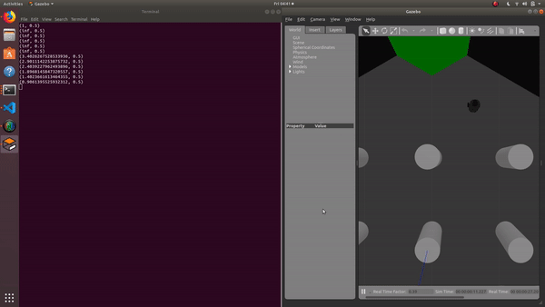

#ROSServer Project Brandeis Automation Laboratory Summer 2020

Made Initially from Jacob Smith's Cosi 119 work, will be used to create ROS Server so Brandeis Community Members can program real robots from home

## ROS ROOMBA

#### **Overview**

###### runRoomba.sh: A bash file that automatically launches ROSCORE, gazebo, and the runRoomba node

runRoomba.py: A python ROS node (based on wander.py) which drives forward if it does not see a ditacen less than the threshold, and turns if it does. This behavior results in a wall avoiding pattern, much like a roomba.

#### Story

​		To get the roomba program working, I tried different slices of vision in  front of the robot. The angle needs to be wide enough that the robot can see it front of its wheels but not so wide that it turns from a false positive. I also had to remove infinite and 0 junk distances. Finally, I experimented with changing the speed and distance thresholds. 

#### Bugs

​	The robot can get stuck in tight corners, and will easily get stuck on low obstacles. This is because the robot only relies on lidar data, and the lidar is on the top of the robot.	

To Do: widen robot's field of vision, have it turn random amount so it doesn't drive in loops, run on real robot, lengthen time until robot gets stuck

​	Demonstration: This is my roomba program running on the gazebo simulator, it gets stuck after the video 	ends.

**-Jacob Smith** jsmith2021@brandeis.edu