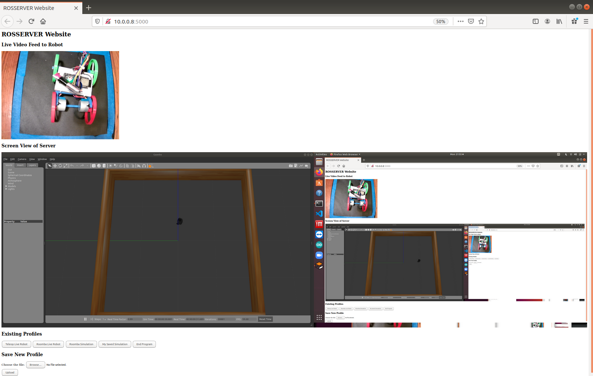
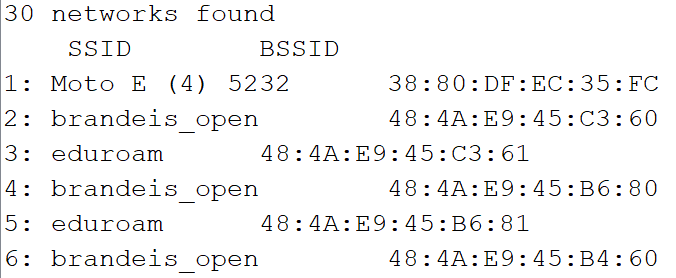
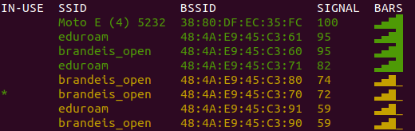
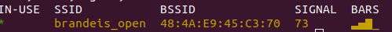
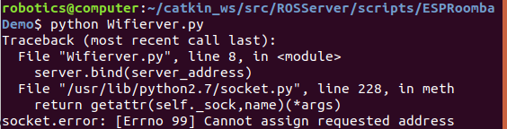

## ROSSERVER Project

#####  Hosts a Server to interact with robots using the Robot Operating System so Brandeis Community Members can program real robots from home.

​	Features:

- ​	Navigating ESP32 Robot using ROS                            (see ESPRoomba Demo Folder)
- ​	Arduino Programs to integrate an ESp32 with ROS (see ROS Arduino Folder)
- ​	Web Hosting Framework                                              (see Other Folder)
- ​	Teleoperated robot in simulator                                 (See Simulation Demo Folder)
- ​	Teleoperated real ESP32 robot                                   (see teleopDemo)

### Image Gallery

#### 	Website Interface

- Features
  - Live Video Feed at Top 
  - Screenshare of ROS Simulator at bottom
  - Launch buttons for available projects, such as autonomous navigation of real and simulated robot
  - Upload a user ROS profile
  - Login Page

#### Roomba Program in Simulator

- Turtlebot can navigate a simulated map using Lidar sensor. 

- see Roomba.py in roomba demo folder

#### Networking Images

​	Wifi networks viewable from:

​		ESP32
​			

​		Computer when not connected to specific BSSID

​		Computer when connected to specific BSSID

​	Cannot assign requested address error from computer

​								 (ip172.20.177.185, port 8090 on brandeis_open )
​					

| Reference Links                                              |                                                              |
| ------------------------------------------------------------ | ------------------------------------------------------------ |
| [Launch tab in gnome](https://unix.stackexchange.com/questions/158434/open-gnome-terminal-with-several-tabs-and-execute-a-few-commands-in-every-tab) | [Running Multiple Robots in ROS](https://answers.ros.org/question/41433/multiple-robots-simulation-and-navigation/) |
| [Rename tab in gnome](https://unix.stackexchange.com/questions/177572/how-to-rename-terminal-tab-title-in-gnome-terminal) | [Multiple instances of Same Node](https://answers.ros.org/question/160071/running-multiple-instances-of-same-node/) |
| [Hide Error Message in Gnome](https://stackoverflow.com/questions/15678796/suppress-shell-script-error-messages) | [Python Script execute bash commands](https://www.quora.com/How-do-I-write-a-Python-script-to-execute-bash-commands-Python-3-6) |
| [Name tab](https://unix.stackexchange.com/questions/24734/how-can-i-launch-gnome-terminal-with-unique-titles-for-multiple-tabs) | [Flask screenshare](https://github.com/nikhil-web/screenshare) [2](https://github.com/gvsurenderreddy/screenshare-2) |
| [Arduino Linux Tutorial](https://www.arduino.cc/en/guide/linux) [2](https://websiteforstudents.com/how-to-install-arduino-ide-on-ubuntu-18-04-16-04/) | [Flask login page](https://realpython.com/introduction-to-flask-part-2-creating-a-login-page/) |
| [ESp32 Download error](https://community.platformio.org/session/sso?return_path=%2Ft%2Fa-fatal-error-occurred-invalid-head-of-packet%2F10233%2F2) | [launch multiple gnome terminals](https://unix.stackexchange.com/questions/373186/open-gnome-terminal-window-and-execute-2-commands) |
| ROS on ESP32 Links [1](https://blog.hadabot.com/ros2-esp32-to-control-motor-driver-using-web-browser.html) [2](https://www.hackster.io/khasreto/run-rosserial-over-the-internet-with-esp32-0615f5) [3](https://github.com/ros-drivers/rosserial/tree/noetic-devel/rosserial_arduino/src/ros_lib) [4](https://github.com/ros-drivers/rosserial/pull/345) [5](http://wiki.ros.org/action/fullsearch/rosserial_arduino?action=fullsearch&context=180&value=linkto%3A"rosserial_arduino"') [6](https://medium.com/@e850506/ros-serial-with-esp-32-246248cb6bac) [7](https://www.birdbraintechnologies.com/roboticsathome/) | [launch terminal from python](https://unix.stackexchange.com/questions/373186/open-gnome-terminal-window-and-execute-2-commands) |
| [Inlcuding Arduino Libraries in Linux](https://forum.arduino.cc/index.php?topic=141190.0) | [change camera orientation gazebo](https://answers.gazebosim.org//question/408/is-there-a-way-to-modify-the-default-camera-position-in-the-world-file/) |
| [Using TImer Library](https://github.com/BrandeisMakerLab/Robotics_ZumoAutomation) | [run program in background](https://askubuntu.com/questions/106351/running-programs-in-the-background-from-terminal) |
| [ESP32 Multithreading](https://randomnerdtutorials.com/esp32-dual-core-arduino-ide/) | [connext to wifi network using bssid](https://forum.arduino.cc/index.php?topic=642938.0) |
| ROSSERIAL  [1](https://github.com/ros-drivers/rosserial) [2](http://wiki.ros.org/rosserial_arduino/Tutorials/Arduino IDE Setup) | [require username and password to access website](https://flask-basicauth.readthedocs.io/en/latest/) |
| ROSSERIAL ESP32 [1](https://github.com/sachin0x18/rosserial_esp32/tree/master/src/examples/echo) [2](https://www.hackster.io/khasreto/run-rosserial-over-the-internet-with-esp32-0615f5) [3](https://answers.ros.org/question/328467/sending-rostopic-form-esp32-through-husarnet/) | [ip adress tunneling](https://www.sitepoint.com/accessing-localhost-from-anywhere/) |
| Cmd Vel with Motor Speeds [1](https://github.com/UbiquityRobotics/ubiquity_motor/tree/kinetic-devel/src) [2](https://github.com/danielsnider/simple_drive/blob/master/drive_firmware/src/main.cpp) [3](https://github.com/ros-controls/ros_controllers/tree/melodic-devel) [4](https://github.com/merose/diff_drive) [5](https://answers.ros.org/question/209963/cmd_veltwist-transform-twist-message-into-left-and-right-motor-commands/) | [get unique id of ESP 32]( https://www.reddit.com/r/esp32/comments/fan3rj/unique_id/) |
| [FLASK Video Stream](https://github.com/ramonus/flask-video-stream) [2](https://github.com/ManivannanMurugavel/opencv-flask-livecam/blob/master/app.py) [3](https://github.com/log0/video_streaming_with_flask_example) | [alternative to ngrok for tunneling](https://github.com/mmatczuk/go-http-tunnel) |
| [FLASK file upload](https://github.com/thamizhchelvan/Python/blob/master/flask-file-upload/app.py) | [get bssid from ubuntu](https://askubuntu.com/questions/833905/how-can-i-connect-to-a-specific-bssid) |
|                                                              | [Webcam From Terminal](https://help.ubuntu.com/community/Webcam) |

**-Jacob Smith**  jsmith2021@brandeis.edu for Brandeis Automation Laboratory 